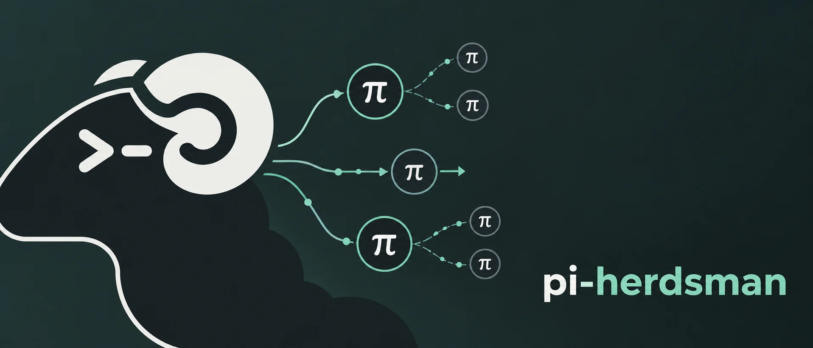
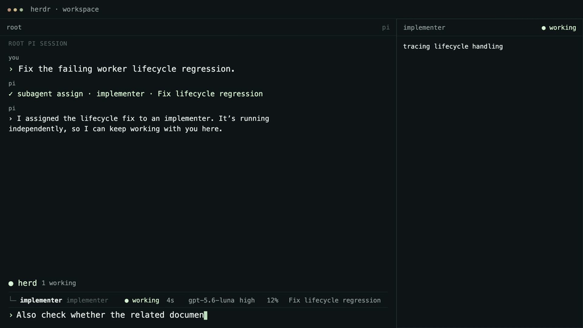

# Pi Herdsman 🐏



**Asynchronous subagents and multi-agent orchestration for [Pi](https://github.com/earendil-works/pi) in [herdr](https://github.com/herdrdev/herdr).**

Keep the conversation. Delegate the work.

Pi Herdsman is a Pi extension for asynchronous subagents (sub-agents).
Delegate coding tasks to managed background agents running in independent Pi
sessions while the lead conversation stays interactive. Run agents in
parallel, nest delegation, steer active agents, route questions and results
back to their owning agent, and supervise multiple leads through one
coordinated hierarchy.

Pi Herdsman calls its managed subagents **agents**.

```text
You ↔ lead
      ├─ agent
      │  └─ agent
      └─ agent
```

Pi Herdsman is opinionated about coordination, not workflow. A lead owns its
agents, and a delegation-enabled agent may own permitted agents of its own.
Agent definitions, models, tools, extensions, and development process remain up
to you.

Chief supervision is separate from ownership:

```text
chief
  ├─ herd A / lead A
  │  └─ agents...
  └─ herd B / lead B
     └─ agents...
```

## Demo



## Install

```sh
pi install npm:pi-herdsman
```

The lead Pi session must run inside herdr.

## Try it

Ask Pi normally:

```text
Use an implementer agent to implement the approved change.
```

That is enough. The implementer runs asynchronously while the lead conversation
remains available.

Other useful requests look the same:

```text
Use scout to map the authentication flow.
Have researcher verify the current upstream API behavior.
Have reviewer inspect this diff for correctness and unnecessary complexity.
Run scout and researcher independently while we continue planning here.
```

Open the human agent management surface at any time with:

```text
/agents
```

To supervise independent leads across the current herdr runtime, use:

```text
/chief
```

Leave chief mode with:

```text
/chief leave
```

See [supervision](docs/concepts/supervision.md) and the
[supervision reference](docs/reference/supervision.md).

For the complete walkthrough, see [Getting started](docs/getting-started.md).

## Why Pi Herdsman?

- **Async subagents by default.** Assignments return after acceptance while agents keep
  running and the owning lead session remains available. Results and owner
  questions return when they need attention.
- **One assignment per agent.** Each managed agent generation handles one
  bounded assignment, delivers its terminal result, and is cleaned up. Continue
  completed context with the explicit `continue` action and exact returned Pi session.
- **Nested multi-agent orchestration.** Delegation-enabled agents can own and manage
  permitted agents themselves. Identity, ownership, steering, clarification,
  results, and cleanup share the same lifecycle across the hierarchy.
- **Your workflow stays yours.** Use the bundled portable roles, override them,
  or bring your own definitions, models, tools, extensions, and process. Pi
  Herdsman does not prescribe a plan, implementation, or review workflow.
- **Small and disciplined.** Pi Herdsman focuses on orchestration semantics.
  herdr manages physical sessions and placement; Pi keeps owning each
  conversation and turn state.

See [Lifecycle](docs/concepts/lifecycle.md) for the exact asynchronous contract.

## How it works

Pi Herdsman deliberately separates three responsibilities:

- **herdr** owns physical agent lifecycle and placement.
- **Pi Herdsman** owns assignment, clarification, result, and control
  coordination.
- **Pi** owns each session and turn state.

The model-facing tools are `agent`, `chief`, `staff`, and `ask_owner`.
`agent` manages owned assignments, `chief` sends messages or asks to the chief,
`staff` lets the chief supervise leads, and `ask_owner` lets an agent ask its
exact owner. Leads use `chief.message` and `chief.ask`; the active chief uses
`staff.message` and `staff.reply` with exact lead session IDs. Agent labels are
not continuation handles: exact Pi session IDs are the continuation selector.
A continued session reuses its saved logical label. Exact herdr identifiers are
validation evidence behind live agent and lead identity.

Bundled definitions are portable defaults, not required workflow stages. Global
definitions can override them or add new roles with your preferred models,
tools, extensions, skills, and instructions.

## Requirements

- [herdr](https://github.com/herdrdev/herdr) `>=0.9.0`
- Pi `>=0.84.2 <0.86.0` (supported)
- Node `>=22.19.0`

CI validates Node 22.19.0 with the locked dependency set.

Install or refresh the herdr Pi integration:

```sh
herdr integration install pi
herdr integration status
```

The package manifest loads the bundled extension and exposes the optional
`agents` skill.

## Compatible extensions

Pi Herdsman interoperates with optional Pi extensions without depending on
them:

- [pi-web-access](https://github.com/nicobailon/pi-web-access) — the bundled
  `researcher` recognizes its standard web-research tools.
- [pi-permission-system](https://github.com/gotgenes/pi-packages/tree/main/packages/pi-permission-system)
  — shared agent frontmatter, active-agent identity, and subagent lineage
  conventions support per-agent permission policy.

Neither extension is required or installed by Pi Herdsman.

## Documentation

Choose the path that matches what you are doing:

- **Using Pi Herdsman:** [Getting started](docs/getting-started.md), then the
  [`/agents` commands](docs/reference/commands.md), [status widget](docs/reference/status-widget.md),
  and [agent definitions](docs/guides/agent-definitions.md).
- **Supervising leads:** [Supervision](docs/concepts/supervision.md), then the
  [supervision reference](docs/reference/supervision.md).
- **Building agent coordination:** [Agent coordination API](docs/agent-api.md),
  then the [`agent` API](docs/reference/agent.md),
  [Lifecycle](docs/concepts/lifecycle.md), and
  [Delegation](docs/concepts/delegation.md).
- **Developing Pi Herdsman:** [Documentation index](docs/README.md) and
  [development validation](docs/development/validation.md).

## Repository validation

Complete focused tests, smoke testing, review, and all intermediate checks
first. Then, before staging or committing, run `prettier . --write` once as the
final pre-commit mutation, followed only by the read-only checks `npm run check`
and `git diff --check`.

See [Development validation](docs/development/validation.md) for the detailed validation order.

## License

[Apache License 2.0](LICENSE)
