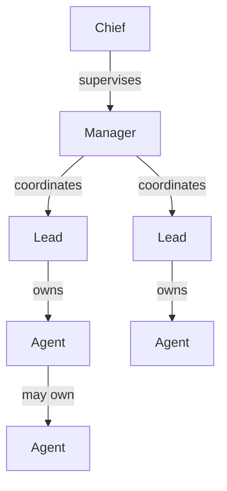

# Coordination

[Documentation index](../README.md) · [Project orchestration](../guides/project-orchestration.md)

Pi Herdsman separates supervision, execution ownership, and physical placement.
Those relationships intentionally do not collapse into one global Agent tree.

## Roles



The same model in text:

```text
supervision: Chief -> Manager -> Lead
ownership:                    Lead -> Agent -> Agent
```

When a project has no active Manager, Chief may directly supervise its ordinary
Leads. A Chief never gains Agent ownership through that fallback.

### Lead

Every normal session starts as a Lead. A Lead owns its assigned objective and
its direct Agents. A delegation-enabled Agent may in turn own only the Agents
its definition permits.

A Lead and its recursively owned Agent hierarchy form a **herd**.

### Manager

Manager is a dedicated project-coordination mode. It coordinates ordinary Leads
inside one Herdsman project scope and has no `agent` capability of its own.

Project execution belongs to Leads and their Agent trees. Manager can inspect
and communicate with direct Leads, but it does not acquire ownership of their
Agents.

### Chief

Chief is an optional workspace-neutral supervision mode for one Herdr runtime.
It acts on current Managers and on ordinary Leads whose project scope has no
active Manager.

Chief can observe bounded descendant summaries but acts only on direct reports.

### Agent

An Agent performs one bounded delegated assignment for its exact owner.
Delegation-enabled Agents may own permitted direct Agents. Managed Agents do not
participate in Manager, Chief, staff, supervisor, or peer authority.

## Project scope

A Herdsman **project** is the coordination scope corresponding to one Herdr Git
worktree group: its primary workspace plus linked-worktree workspaces.

Manager authority is scoped to that group. A Lead in the primary workspace may
enter Manager mode; a Lead in a linked-worktree workspace remains a Lead. An
ordinary Git primary workspace does not need an existing linked worktree before
Manager activation; the first project delegation can create one.

An optional user-wide auto-start preference can attempt the same Manager startup
for a session with no persisted role intent in the primary workspace. Explicit
session intent takes precedence, and automatic activation does not persist a
Manager role.

Workspace membership is physical placement, not assignment ownership. Multiple
Leads can share a workspace, and a branch can have a worktree without implying
that every session in that workspace owns its work.

## Project work belongs to a branch

Manager-delegated project work is durable and keyed by repository plus semantic
Git branch.

Within one repository, the branch is the public work handle. A Lead is the
current executor. The assignment's exact Pi session ID is an internal executor
identity; exact session IDs are used only when acting on a live Lead.

Because durable work is not keyed by a Manager or primary workspace identity, a
replacement Manager or replacement primary workspace for the same repository
does not create a new project assignment. Current Herdr topology is derived
again when the work is observed or resumed.

```text
project work
    ├─ branch feat/a → current Lead → Agent tree
    └─ branch feat/b → current Lead → Agent tree
```

The assignment is the durable indicator that project work remains open. It
survives Manager turnover and runtime loss; current Herdr placement is derived
again when the work is observed or resumed. For an assigned project, Herdsman
automatically records the Lead's normal response to each project-assignment
delivery as a project message for the current or a replacement Manager. If
the Lead successfully delegates or continues managed Agent work, the herd run
owns that handoff until it settles, and the settled response should summarize
outcome, validation, and important unresolved points. An unsuccessful
delegation leaves the local assignment-response path available. Later
conversational replies, including routine acknowledgments, stay local and are
not automatically promoted. This handoff is advisory and does not resolve the
assignment. Assigned
Lead messages sent with `supervisor_message` are also retained with the project
and remain available to a replacement Manager. Project retirement follows
successful Herdr worktree removal; see
[Project orchestration](../guides/project-orchestration.md) for the workflow.

`staff_stop` pauses execution while preserving the assignment, Pi session,
branch, and worktree. Successful Herdr worktree removal retires the matching
assignment and its retained project messages while preserving the Git branch.
A worktree that is merely missing does not retire the assignment; it remains
recoverable through `staff_resume`.

For the task-oriented workflow, see
[Project orchestration](../guides/project-orchestration.md). Exact operations
live in [Staff tools](../reference/staff.md).

## Direct edges only

Coordination crosses one authority edge at a time:

| Direction | Interface              | Boundary                                             |
| --------- | ---------------------- | ---------------------------------------------------- |
| Down      | `staff_*`              | Chief -> direct Manager/Lead, Manager -> direct Lead |
| Up        | `supervisor_*`         | Lead -> Manager or Chief, Manager -> Chief           |
| Sideways  | `peer_*`               | Lead <-> Lead or Manager <-> Manager                 |
| Ownership | `agent_*`, `ask_owner` | owner <-> directly owned Agent                       |

A supervisor may observe bounded descendant state without gaining descendant
control. Questions and messages are not implicitly forwarded through
intermediate coordinators.

## Usage follows ownership

Session usage uses Pi's native token and cost records. In ordinary sessions,
`/agents stats` covers the current Pi session and transitively owned managed
Agents whose exact persisted identities can be verified.

When the current session is an active Manager, stats additionally cover the
Lead sessions named by its current durable project assignments, along with each
included Lead's transitively owned managed-Agent sessions. The Manager's own
directly owned Agents remain included as well. Durable assignment identity
selects managed Leads; live herdr topology is not required, so a paused Lead or
missing worktree does not by itself exclude a still-assigned project. Retired
assignments no longer contribute to current Manager stats.

Known assignment IDs may be resolved through Pi's native global session
inventory. That discovery locates the exact assigned session but never
establishes ownership or scope by itself: project assignments select Leads,
and durable Agent ownership determines their Agent trees. Usage that cannot be
verified within the in-scope sessions is omitted and reported as incomplete
coverage rather than guessed. Chief staff, peer Leads, and unrelated sessions
remain outside the accounting scope.

See [Commands](../reference/commands.md#agents-stats) for the exact presentation
and coverage rules.

## System responsibilities

| System          | Responsibility                                                                       |
| --------------- | ------------------------------------------------------------------------------------ |
| **Pi**          | Session history, turns, model interaction, and conversation continuity               |
| **Pi Herdsman** | Assignment ownership, coordination, project-work semantics, and authority validation |
| **herdr**       | Processes, panes, tabs, workspaces, placement, and Git worktree topology             |
| **Git**         | Branches, commits, and repository state                                              |

Physical layout and display metadata are evidence or presentation, not
coordination authority. Control requires current validated identity and fails
closed when evidence is stale, missing, duplicated, or ambiguous.

## Role transitions

`/manager` enters Manager mode from an eligible Lead in the primary workspace.
`/manager leave` returns to Lead while preserving project work.

`/chief` enters Chief mode from an eligible ordinary Lead. A Manager cannot
activate Chief. `/chief leave` returns to Lead.

Both special roles restore the Lead tool baseline when they are left. Exact
eligibility and command behavior are documented in
[Commands](../reference/commands.md).

## See also

- [Project orchestration](../guides/project-orchestration.md)
- [Delegation](delegation.md)
- [Agents and identity](agents.md)
- [Staff tools](../reference/staff.md)
- [Supervisor tools](../reference/supervisor.md)
- [Peer tools](../reference/peer.md)
